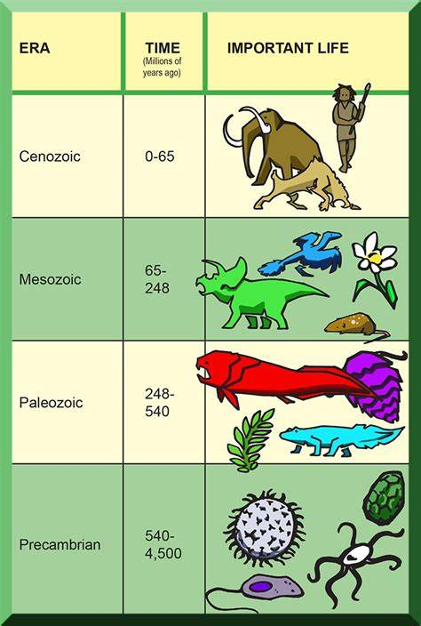

# AIZOIC - Join You to AI Era

At the dawn of the new era of artificial intelligence, we are committed to creating an artificial intelligence aggregation platform that allows users to directly access various AI models emerging around the world without any additional settings, one-stop, zero-threshold, and low-cost, and can talk, draw, design logos, make documents, make tables, and write code、...... Make it easy for users to sync with the world's strongest, latest, and most powerful AI.

### AIZOIC, the next era to the CENOZOIC

The Cenozoic is the era of the explosion of animal and plant life on Earth, and mammoths, saber-toothed tigers, whales, scared birds, and angiosperms flourished on the earth. The most important thing for humans, mammals, rose.

AIZOIC, the era of artificial intelligence explosion, GPT, BERT, OpenAI, DeepMind, 、......, have emerged, overwhelmed, anxiety: Will my job be replaced? Can I keep up with AI?

That's why **AIZOIC** was born! Here, we are committed to letting you directly reach all kinds of AI in the world with zero threshold, so that you can easily synchronize with the AI Nascent!

To this end, the [AIZOIC ](https://u.aizoi.cc)service platform, built using the latest technology, connects you with AI, allowing you to use AI with zero barriers. It assists you in your creative work and daily life, making it easy for you to synchronize with the AI era!

[**Clain credits and try it now!**](https://u.aizoi.cc)

##### Zero threshold

No additional setup is required, and you can reach all the world's major AI!

No over the wall! No overseas mobile phone number required! No overseas credit card required!

Don't download! Do not install! Do not set! Don't look at the tutorial!

😄😄😄 Just open the link or scan the code and talk directly to the world's top AI like any regular app. 😄😄😄

❌❌❌ In contrast, almost all other AI channels require cumbersome pre-technical preparation to be able to connect to world-class AI intermittently. For the vast majority of users, this is actually an impossible task, even if you spend a lot of money to buy an account, buy a tutorial, buy a book, you can't use it! ❌❌❌

[Claim credit to try it now!](https://u.aizoi.cc)

### One stop with all channels

We will continue to integrate various AI models and applications. No matter where you are from, no matter what new AI emerges in the world, we will be the first to get it to you!

We deliver the service through all major channels, including [Web, iOS, Android apps](https://u.aizoi.cc/#/pages/user-resource).

Need to customize your own model? Contact us and we can train your private AI model for you.

[Claim credit to try it now!](https://u.aizoi.cc)

### Lower cost

Your cost is also our concern, and we are committed to providing you with the best value for money.

We don't sell accounts! Don't sell lessons! Don't sell books! No, no, no, don't play anything imaginary!

Ready to go! Everything we have is pure dry goods!

We give each new user a free credit to experience AI models with confidence.

For long-term users, we pay as you go flexibly based on AI power consumption: start at a penny! Pay as you go! No need not pay!

[Claim credit to try it now!](https://u.aizoi.cc)

(Suggestion: You can [join one of our communities](https://u.aizoi.cc/#/pages/user-resource) at first, ask a CSR to obtain a promo code, then to register, you can get doubled rewards)

### Globalization and Localization

We are open to the world and provide global service at [earth.aizoi.cc](https://u.earth.aizoi.cc)

We also provide localized services to respect local culture and policies. For example, we provide a localized site for China with special content censorship aligned with China's policies, so that Chinese users can visit us as smooth as possible.

### Decentralization

Our service facilities are distributed all over the world, and we use decentralized blockchain (Blockchain), Interplanetary File System (IPFS), data autonomy (Web3) and other infrastructure to implement end-user applications.

### About us

We are a global team that operates as a decentralized DAO. Whether you are an engineer, designer, investor, feel free to contact us at [hi@aizoi.cc](hi@aizoi.cc) or[ join communities](https://u.aizoi.cc/#/pages/user-resource) to ask any questions for any purposes!

---

[Back to Contents Table](./README.md)
